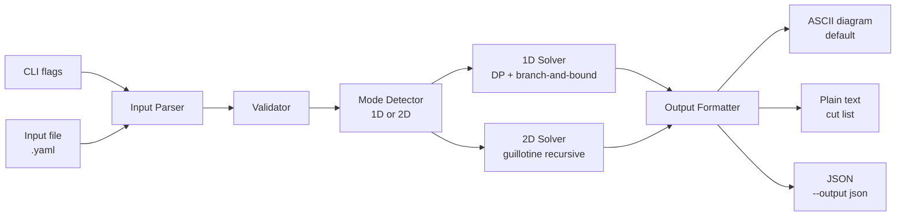

# Architecture

## System Overview

`cut-calculator` is a single Go binary with no external runtime dependencies.
Input comes from CLI flags, a file, or both. Output goes to stdout.



---

## Package Structure

```
cut-calculator/
  cmd/
    cut-calculator/
      main.go           ← entry point; wires everything together
  internal/
    model/              ← shared types used across all packages
      types.go          ← StockPiece, RequiredPiece, CutPlan, Assignment, etc.
    input/
      flags.go          ← CLI flag definitions and parsing
      file.go           ← YAML file parsing
      merge.go          ← merge flags + file input, flags take precedence
      validate.go       ← input validation and mode detection
    solver/
      solver.go         ← common interface: Solve(input) → CutPlan
      solver1d/
        dp.go           ← 1D DP knapsack + branch-and-bound
      solver2d/
        guillotine.go   ← 2D recursive guillotine packing
    output/
      ascii.go          ← ASCII diagram renderer
      text.go           ← plain text cut list
      json.go           ← JSON marshalling
```

---

## CLI Interface

### Flags

| Flag | Type | Description |
|------|------|-------------|
| `-f`, `--file` | string | Path to input YAML file |
| `--stock` | string (repeatable) | Stock piece: `96` (1D) or `48x96` (2D). Suffix `:N` for count, `:onhand` for owned |
| `--need` | string (repeatable) | Required piece: `36` (1D) or `24x36` (2D). Suffix `:N` for count |
| `--kerf` | float | Blade kerf width in inches (default: `0`) |
| `--no-rotate` | bool | Disable piece rotation in 2D mode (default: false) |
| `--output` | string | Output format: `ascii` (default), `text`, `json` |

### Flag examples

```bash
# 1D: three 8-foot boards on hand, need four 3-foot and two 4-foot pieces
cut-calculator --stock 96:3:onhand --need 36:4 --need 48:2 --kerf 0.125

# 2D: one 4x8 sheet on hand, need four 2x3 pieces
cut-calculator --stock 48x96:1:onhand --need 24x36:4

# JSON output
cut-calculator -f myproject.yaml --output json
```

---

## Input File Format (YAML)

YAML is chosen for its readability — minimal punctuation, easy to write by hand.

### 1D example

```yaml
kerf: 0.125       # inches; omit or set 0 to ignore kerf

stock:
  - length: 96    # inches
    count: 3
    on_hand: true   # already owned
  - length: 96
    on_hand: false  # available to purchase if needed

need:
  - length: 36
    count: 4
  - length: 48
    count: 2
  - length: 22
    count: 1
```

### 2D example

```yaml
kerf: 0.125
rotate: true      # default; set false to lock orientation

stock:
  - width: 48
    height: 96
    count: 1
    on_hand: true
  - width: 48
    height: 96
    on_hand: false   # buy more if needed

need:
  - width: 24
    height: 36
    count: 4
  - width: 12
    height: 12
    count: 6
```

### Pattern-repeat example (wallpaper)

```yaml
rotate: false     # orientation must be preserved

stock:
  - width: 27      # 27" wide wallpaper roll
    height: 240    # 20 feet
    on_hand: true
    repeat_distance: 24   # pattern repeats every 24"
    repeat_axis: height   # repeat runs along the height (vertical)

need:
  - width: 27
    height: 96
    count: 3
    label: "wall-A"
```

### Join-group example

```yaml
stock:
  - length: 96
    count: 2
    on_hand: true

need:
  - length: 48
    count: 2
    join_group: "panel-left"   # these two will be edge-glued
  - length: 36
    count: 1
```

### Merge rules (flags + file)

When both `-f` and flags are provided:
- File provides the base input
- Flags **add** to stock and need lists (they do not replace)
- `--kerf`, `--no-rotate`, `--output` flags **override** file values

---

## Core Types (`internal/model`)

```go
type Dimension int  // 1 = 1D, 2 = 2D

type StockPiece struct {
    Length         float64  // 1D
    Width          float64  // 2D
    Height         float64  // 2D
    Count          int
    OnHand         bool
    RepeatDistance float64  // 0 = no repeat constraint
    RepeatAxis     string   // 2D only: "height" or "width"; ignored in 1D
}

type RequiredPiece struct {
    Label     string   // auto-assigned: A, B, C...
    Length    float64  // 1D
    Width     float64  // 2D
    Height    float64  // 2D
    Count     int
    JoinGroup string   // pieces sharing a label are combined-cut candidates; "" = no group
}

type Cut struct {
    Position float64  // 1D: distance from start; 2D: x or y coordinate
    Axis     string   // 2D only: "x" or "y"
}

type Assignment struct {
    StockIndex      int
    RequiredLabel   string
    Cuts            []Cut
    OffsetX         float64  // 2D: top-left corner of placed piece
    OffsetY         float64
    Rotated         bool
}

type CutPlan struct {
    Mode        Dimension
    Assignments []Assignment
    Offcuts     []StockPiece
    WastePct    float64
    Purchased   []StockPiece  // additional stock needed beyond on-hand
}
```

---

## Solver Interface

Both solvers implement the same interface so the output layer doesn't care which ran:

```go
type Solver interface {
    Solve(stock []StockPiece, need []RequiredPiece, kerf float64, rotate bool) (CutPlan, error)
}
```

---

## Output Rendering

All three output modes receive the same `CutPlan` and render it differently.

### ASCII diagram (1D example)

```
Stock #1 (96") — on hand
|--36"--A--|--48"--B--|--kerf--|  [waste: 10"]
  ^cut        ^cut

Stock #2 (96") — on hand
|--36"--A--|--36"--A--|--22"--C--|  [waste: 2"]
```

### ASCII diagram (2D example)

```
Sheet #1 (48" × 96") — on hand
+------------------------+
|  A (24×36)  | B (24×36)|
|             |          |
+-------------|----------+
|  C (12×12)  |          |
+-------------+          |
    waste: 18%
```

### Plain text cut list

```
Stock #1 — 96" board (on hand)
  Cut 1: 36"  → Piece A
  Cut 2: 48"  → Piece B
  Offcut: 10"

Stock #2 — 96" board (on hand)
  Cut 1: 36"  → Piece A
  Cut 2: 36"  → Piece A
  Cut 3: 22"  → Piece C
  Offcut: 2"

Overall waste: 6.25%
Nothing to purchase — all pieces fit within on-hand stock.
```
