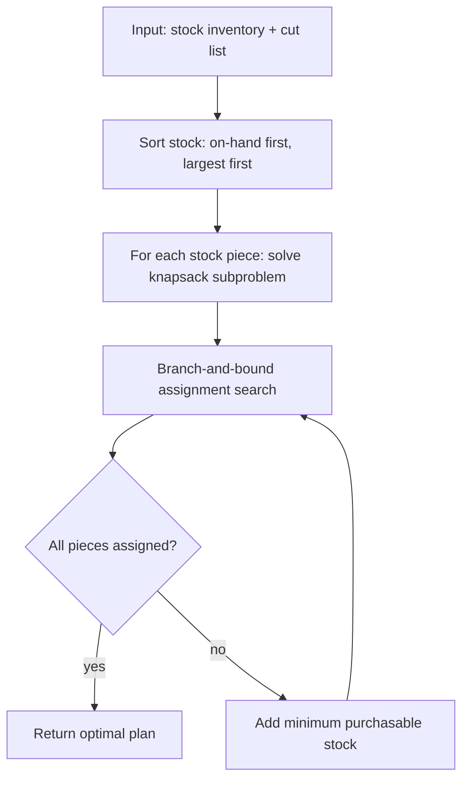
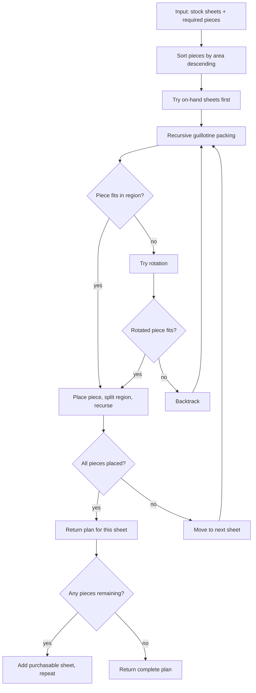

# Business Logic

## Problem Definition

Given:
- A **stock inventory** — one or more pieces of raw material (boards, sheets, offcuts)
- A **cut list** — the required output pieces and their sizes

Produce:
- An **assignment** of every required piece to a stock piece
- A **cut sequence** for each stock piece
- A **waste report** showing offcuts and total material efficiency
- A recommendation for **additional stock to purchase** if the inventory is insufficient

The optimizer must guarantee every required piece is produced. Minimizing waste is the primary objective. Using existing stock before suggesting new purchases is the secondary objective.

---

## Key Concepts

### Kerf Width
A saw blade removes a small amount of material with each cut — typically 1/8" (3mm) for a circular saw. This is called the **kerf**. For a single cut it's negligible, but across 20 cuts on one board it adds up to 2.5". The optimizer accounts for kerf on every cut.

Kerf width is user-configurable. Default: `0` (no kerf). Users set it once per session or per stock material type.

### 1D vs 2D Mode
The tool auto-detects mode based on input:
- All stock and required pieces have **one dimension** → 1D mode
- Any stock or required piece has **two dimensions** → 2D mode

Mixed 1D/2D input in a single session is not supported.

### Guillotine Cuts (2D only)
A guillotine cut goes straight across the full width or height of a panel — which is how a circular saw, table saw, or track saw physically works. The optimizer only produces guillotine-compatible layouts. Non-guillotine arrangements (L-shapes, irregular nesting) are never suggested.

### Rotation (2D only)
By default, required pieces may be rotated 90° if it produces a better fit. Rotation can be disabled globally (`--no-rotate`) for materials where orientation matters (e.g. wood grain, pegboard hole alignment, wallpaper).

### Pattern Repeat
Some materials have a design that repeats at a fixed interval — wallpaper, patterned fabric, decorative tile. For cuts from these materials to align visually when installed, each piece must start at a **repeat boundary**: a position that is a whole multiple of the `repeat_distance`.

`repeat_distance` is a property of the **stock piece** (it describes the material, not the piece being cut). When set, the solver pads placement positions to the next repeat boundary as needed. This padding counts as required waste — it is reported separately from kerf waste.

In 2D, repeat applies to one axis only (`repeat_axis: height` or `repeat_axis: width`). In 1D, the single axis is implicit.

Pattern repeat is almost always used with `--no-rotate`, since orientation must be preserved for the pattern to align.

**Example:** `repeat_distance: 24` on a 96" stock piece. A 36" piece placed at position 0 ends at 36". The next piece must start at 48" (the next 24" boundary), leaving a 12" alignment gap.

### Join Groups
When two or more required pieces will be joined in the final product (e.g. edge-glued boards, seamed wallpaper panels), tagging them with a `join_group` lets the solver treat them as a single combined piece for cutting purposes.

The solver tries both options — cut individually vs. cut as one combined piece — and uses whichever produces less total waste. The combined piece's dimensions are the sum of the individual pieces along the joining axis (width for side-by-side, height for stacked).

In the output, a combined piece is shown as one rectangle with a **dashed line** at the join boundary and both labels.

### Mixed Stock
Stock pieces are tagged as either:
- **On hand** — already owned; the optimizer uses these first at no cost
- **Available** — a standard size the user can purchase; the optimizer uses these only after exhausting on-hand stock

The optimizer reports the minimum number of "available" pieces to buy to complete the cut list.

---

## 1D Algorithm

**Problem class:** 1D bin packing / cutting stock

**Algorithm: Exact Dynamic Programming**

For DIY-scale inputs (≤ ~200 required pieces, ≤ ~50 stock pieces), an exact DP solution is computationally feasible and guarantees the optimal answer.

**Approach:**

1. For each stock piece, solve a **bounded knapsack** subproblem: find the subset of required pieces that fits within the stock length (accounting for kerf between cuts) and maximizes used length.
2. Assign required pieces to stock pieces using a **branch-and-bound** search over the full assignment, guided by the knapsack values.
3. On-hand stock is tried before available (purchasable) stock.
4. If available stock is needed, find the minimum number of additional pieces required.

**Waste metric:** `(total stock length used − total required length) / total stock length used`

---

## 2D Algorithm

**Problem class:** 2D guillotine bin packing

**Algorithm: Recursive Guillotine with Branch-and-Bound**

For DIY-scale 2D inputs, a recursive guillotine approach with pruning is tractable and produces optimal or near-optimal results.

**Approach:**

1. Sort required pieces largest-first (by area).
2. For each stock sheet, attempt to pack remaining pieces using **recursive guillotine subdivision**:
   - Place the next piece in the top-left corner of the current region.
   - Make a guillotine cut (horizontal or vertical — try both).
   - Recursively pack each resulting sub-region.
   - Backtrack if no valid placement exists.
3. Rotation is tried at each placement step (unless `--no-rotate`).
4. On-hand sheets are tried before purchasable sheets.
5. Branch-and-bound pruning skips branches where remaining area is provably insufficient.

**Kerf** is applied to each guillotine cut, reducing the usable area of sub-regions accordingly.

**Waste metric:** `(total sheet area used − total required piece area) / total sheet area used`

---

## Output Contract

Every successful run produces:

| Field | Description |
|-------|-------------|
| `assignments` | Each required piece → which stock piece it comes from |
| `cut_sequences` | Per stock piece: ordered list of cuts with positions |
| `offcuts` | Leftover pieces per stock, with dimensions |
| `waste_pct` | Overall material waste percentage |
| `purchased` | List of additional stock pieces the user needs to buy |

If no valid plan exists (e.g. a required piece is larger than any available stock), the tool reports which pieces could not be fit and why — it never silently drops pieces.

---

## Edge Cases

| Case | Behavior |
|------|----------|
| Required piece larger than all stock | Error: report which piece(s) cannot be cut, suggest stock size needed |
| Empty cut list | Error: nothing to do |
| Empty stock inventory | Error: no stock provided |
| Required piece exactly equals stock size (no kerf room) | Assign as a zero-waste cut; no saw cut needed |
| Duplicate required sizes | Treated as separate pieces — each must be assigned |
| Stock piece already smaller than smallest required piece | Skip it; report as unusable offcut |
| `repeat_distance` set but piece doesn't fit within one repeat interval | Error: piece is larger than the repeat distance; alignment is impossible |
| `join_group` with only one member | Treated as a normal individual piece (no-op) |
| `join_group` members have incompatible dimensions for combining | Error: report which group cannot be combined and why |
